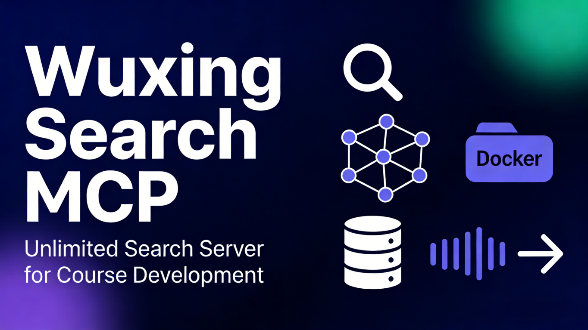

<p align="center">
  
</p>

<p align="center">
  <a href="README.en.md">
    <b>English | 中文</b>
  </a>
</p>

<p align="center">
  <strong>兼容 Claude Code、Cursor、Windsurf 和其他 AI 驱动的 IDE</strong>
</p>

<h1 align="center">Wuxing Search MCP</h1>

<p align="center">
  <i>基于 SearXNG 的无限制搜索 MCP Server</i>
</p>

<p align="center">
  <strong>一个强大的无限制搜索服务器，聚合 100+ 搜索引擎</strong>
</p>

<p align="center">
  <a href="https://github.com/MaesHughes/wuxing-search-mcp">
    
  </a>
  <a href="https://github.com/MaesHughes/wuxing-search-mcp/blob/main/LICENSE">
    
  </a>
  
  
  
</p>

<p align="center">
  <a href="#-功能特点">功能特点</a> •
  <a href="#-快速开始">快速开始</a> •
  <a href="#-安装">安装</a> •
  <a href="#-使用方法">使用方法</a> •
  <a href="#-管理命令">管理命令</a> •
  <a href="#-故障排查">故障排查</a>
</p>

---

## 什么是 Wuxing Search MCP？

**Wuxing Search MCP** 是一个基于 [SearXNG](https://searxng.org/) 构建的强大无限制搜索服务器。它通过模型上下文协议与 [Claude Code](https://claude.ai/code) 无缝集成，通过聚合 100+ 搜索引擎的结果，提供免费且无限制的搜索能力。

### 为什么选择 Wuxing Search？

传统搜索 API 存在限制：
- ❌ 速率限制和配额
- ❌ 昂贵的 API 成本
- ❌ 单一来源的结果

**Wuxing Search 解决了所有这些问题：**
- ✅ **完全免费** - 自建 SearXNG，无 API 成本
- ✅ **无限制搜索** - 禁用速率限制器，支持高频搜索
- ✅ **多源聚合** - Google、Bing、DuckDuckGo、Brave 等 100+ 引擎
- ✅ **隐私友好** - 无追踪，无记录
- ✅ **MCP 集成** - 完美适配 Claude Code 工作流

---

## 架构说明

```
┌─────────────┐      ┌──────────────┐      ┌─────────────┐      ┌─────────────┐
│  你        │ ───▶ │ Claude Code │ ───▶ │ Wuxing      │ ───▶ │  SearXNG    │
│  (用户)    │      │  (MCP 客户端) │      │ Search MCP   │      │ (Docker)    │
└─────────────┘      └──────────────┘      │ (Node.js)   │      │ (Python)    │
                                            └──────────────┘      └─────────────┘
                                                    │
                                                    ▼
                                            ┌───────────────────────────┐
                                            │   搜索引擎聚合           │
                                            │   - Google               │
                                            │   - Bing                 │
                                            │   - DuckDuckGo           │
                                            │   - Brave                │
                                            │   - Wikipedia            │
                                            │   - 以及 100+ 更多...    │
                                            └───────────────────────────┘
```

---

## 功能特点

### ✨ 当前功能

- **🔍 无限制网页搜索**
  - 无 API 速率限制或配额
  - 支持高频搜索
  - 可配置结果数量（1-100）

- **🌐 多源聚合**
  - Google、Bing、DuckDuckGo、Brave
  - Wikipedia、GitHub、Stack Overflow
  - 支持 100+ 搜索引擎

- **📊 高级搜索选项**
  - 时间范围过滤（天、周、月、年）
  - 类别过滤（通用、图片、视频、新闻、IT、科学、文件、社交）
  - 语言过滤
  - 安全搜索级别

- **🔌 MCP 集成**
  - 与 Claude Code 无缝集成
  - stdio 通信（MCP 不需要网络端口）
  - JSON-RPC 2.0 协议

- **🐳 简单部署**
  - 基于 Docker 的 SearXNG 部署
  - 一键安装
  - 跨平台支持（Windows、macOS、Linux）

- **🔒 隐私优先**
  - 无追踪，无记录
  - 自托管，数据不离开你的机器
  - 通过 SearXNG 匿名搜索

---

## 快速开始

4 个简单步骤即可开始：

### 前置要求

- **Docker**（必需）：[下载](https://www.docker.com/products/docker-desktop)
- **Node.js 18+**（必需）：[下载](https://nodejs.org/)

### 1. 克隆项目

```bash
git clone https://github.com/MaesHughes/wuxing-search-mcp.git
cd wuxing-search-mcp
```

### 2. 安装依赖

```bash
npm install
```

### 3. 启动 SearXNG

**方式 A：使用 Docker 命令（推荐）**

```bash
docker run -d \
  --name wuxing-searxng \
  --restart unless-stopped \
  -p 18080:8080 \
  -v "$(pwd)/searxng/config:/etc/searxng/" \
  -v "$(pwd)/searxng/data:/var/cache/searxng/" \
  searxng/searxng:latest
```

**方式 B：使用 Docker Compose**

```bash
docker-compose up -d
```

### 4. 配置 Claude Code

找到你的 Claude Code 配置文件：

**Windows**:
```
%APPDATA%\Claude\claude_desktop_config.json
```

**macOS / Linux**:
```
~/.config/Claude/claude_desktop_config.json
```

### 第一步：获取你的项目路径

在项目目录下运行以下命令获取绝对路径：

**Windows (PowerShell):**
```powershell
Resolve-Path src\index.js
```

**Windows (Git Bash / Bash):**
```bash
pwd -W && echo "/src/index.js"
# 或手动拼接：$(pwd -W)/src/index.js
```

**macOS / Linux:**
```bash
pwd && echo "/src/index.js"
# 或手动拼接：$(pwd)/src/index.js
```

### 第二步：添加配置

在配置文件中添加以下配置，**⚠️ 务必替换 `YOUR_FULL_PATH_HERE` 为上一步获取的实际路径**：

#### Windows 配置示例

```json
{
  "mcpServers": {
    "wuxing-search": {
      "type": "stdio",
      "command": "cmd",
      "args": [
        "/c",
        "node",
        "D:\\\\path\\\\to\\\\wuxing-search-mcp\\\\src\\\\index.js"
      ],
      "env": {
        "SEARXNG_URL": "http://localhost:18080",
        "MAX_RESULTS": "20",
        "TIMEOUT": "30000"
      }
    }
  }
}
```

#### macOS / Linux 配置示例

```json
{
  "mcpServers": {
    "wuxing-search": {
      "type": "stdio",
      "command": "node",
      "args": [
        "/home/username/wuxing-search-mcp/src/index.js"
      ],
      "env": {
        "SEARXNG_URL": "http://localhost:18080",
        "MAX_RESULTS": "20",
        "TIMEOUT": "30000"
      }
    }
  }
}
```

**配置说明：**

| 配置项 | Windows | macOS/Linux | 说明 |
|--------|---------|-------------|------|
| `type` | `"stdio"` | `"stdio"` | 通信协议类型 |
| `command` | `"cmd"` | `"node"` | Windows 使用 cmd 包装器 |
| `args` | `["/c", "node", "路径..."]` | `["路径..."]` | 路径必须使用绝对路径 |
| `env.SEARXNG_URL` | SearXNG 服务地址 | - | 默认 `http://localhost:18080` |
| `env.MAX_RESULTS` | 默认返回结果数 | - | 默认 20，范围 1-100 |
| `env.TIMEOUT` | 请求超时时间（毫秒） | - | 默认 30000 |

**⚠️ 重要提示：**
- Windows 路径中的反斜杠必须转义为双反斜杠 `\\\\`（JSON 格式要求）
- 或者使用正斜杠 `/`（Windows 也支持）
- 路径必须是绝对路径，相对路径无法工作
- 修改配置后需要完全重启 Claude Code 才能生效

### 5. 重启 Claude Code

完全退出并重新打开 Claude Code。

---

## 使用方法

### 基础搜索

在 Claude Code 中直接输入：

```
请搜索最新的 AI 编程工具
```

### 高级搜索参数

你也可以指定参数：

```
请搜索最近一周的 React 教程，返回 10 条结果
```

### 可用工具

#### 1. web_search

执行网页搜索并返回结果。

| 参数 | 说明 | 必需 | 默认值 |
|------|------|------|--------|
| `query` | 搜索关键词 | 是 | - |
| `max_results` | 返回结果数量（1-100） | 否 | 20 |
| `category` | 搜索类别 | 否 | general |
| `language` | 语言代码 | 否 | all |
| `time_range` | 时间范围过滤器 | 否 | none |
| `safesearch` | 安全搜索级别（0-2） | 否 | 1 |

**类别选项：**
- `general` - 通用搜索
- `images` - 图片搜索
- `videos` - 视频搜索
- `news` - 新闻搜索
- `it` - IT 技术
- `science` - 科学
- `files` - 文件
- `social` - 社交媒体

**时间范围选项：**
- `day` - 过去 24 小时
- `week` - 过去一周
- `month` - 过去一月
- `year` - 过去一年
- `none` - 无时间过滤

#### 2. get_server_info

获取搜索服务器状态信息。无参数。

### 使用示例

#### 示例 1：搜索文档

```
请搜索 OpenCode 官方文档和教程
```

#### 示例 2：搜索最新内容

```
请搜索最近一周关于 AI Agent 的文章
```

#### 示例 3：搜索特定类别

```
请搜索 Python 机器学习库的视频教程
```

#### 示例 4：查询服务器状态

```
查询搜索服务器状态
```

---

## 管理命令

### NPM 命令

```bash
# 查看 SearXNG 状态
npm run status:searxng

# 查看 SearXNG 日志
npm run logs:searxng

# 重启 SearXNG
npm run restart:searxng

# 停止 SearXNG
npm run stop:searxng

# 启动 SearXNG
npm run start:searxng

# 测试搜索服务
npm run test:searxng
```

### Docker 命令

```bash
# 查看容器状态
docker ps | grep wuxing-searxng

# 查看实时日志
docker logs -f wuxing-searxng

# 重启服务
docker restart wuxing-searxng

# 停止服务
docker stop wuxing-searxng

# 启动服务
docker start wuxing-searxng

# 删除并重建
docker stop wuxing-searxng && docker rm wuxing-searxng
# 然后重新运行启动命令
```

---

## 配置选项

通过环境变量配置 MCP Server：

| 变量 | 说明 | 默认值 |
|------|------|--------|
| `SEARXNG_URL` | SearXNG 服务地址 | http://localhost:18080 |
| `MAX_RESULTS` | 默认返回结果数 | 20 |
| `TIMEOUT` | 请求超时时间（毫秒） | 30000 |

在 Claude Code 配置的 `env` 字段中添加这些变量来自定义行为。

---

## 故障排查

### 问题 1：搜索工具不显示或报错

**检查清单：**

1. ✅ SearXNG 容器是否运行？
   ```bash
   docker ps | grep wuxing-searxng
   ```

2. ✅ SearXNG 服务是否正常？
   ```bash
   curl http://localhost:18080
   ```

3. ✅ 配置文件路径是否正确（使用绝对路径）？

4. ✅ Node.js 版本是否 >= 18？
   ```bash
   node --version
   ```

5. ✅ Claude Code 是否已重启？

### 问题 2：SearXNG 容器无法启动

**检查：**

1. 端口 18080 是否被占用？
   ```bash
   # Windows
   netstat -ano | findstr :18080

   # Linux/Mac
   lsof -ti:18080
   ```

2. Docker 服务是否运行？

3. 查看容器日志：
   ```bash
   docker logs wuxing-searxng
   ```

**解决方案：**

```bash
# 删除旧容器并重新创建
docker stop wuxing-searxng && docker rm wuxing-searxng
# 然后重新运行启动命令
```

### 问题 3：搜索返回连接错误

**可能原因**：SearXNG 服务尚未完全启动

**解决方案：**

```bash
# 等待 5-10 秒后重试
# 或重启 SearXNG
docker restart wuxing-searxng
```

### 问题 4：结果包含旧内容

**原因**：时间过滤依赖搜索引擎的支持

**解决方案：**

1. 使用更短的时间范围（`day` 而非 `week`）
2. 在 query 中添加明确的时间关键词（如 `2025年1月`）
3. 结合使用：
   ```
   请搜索 2025年1月的 React 新特性
   ```

---

## 技术架构

### MCP Server（Node.js）

- **文件**：`src/index.js`
- **依赖**：@modelcontextprotocol/sdk, axios
- **通信**：stdio（标准输入/输出）
- **作用**：实现 MCP 协议，转发请求到 SearXNG

### SearXNG（Python/Docker）

- **镜像**：searxng/searxng:latest
- **端口**：18080（主机）→ 8080（容器）
- **配置**：searxng/config/settings.yml
- **数据**：searxng/data/（缓存）
- **作用**：聚合 100+ 搜索引擎

### 数据流

```
用户输入
  → Claude Code
  → MCP Server (stdio)
  → HTTP 请求到 SearXNG
  → 并发请求到各搜索引擎
  → 聚合结果
  → 返回给用户
```

---

## 项目结构

```
wuxing-search-mcp/
├── src/                  # MCP Server 源码
│   └── index.js         # MCP Server 主实现
├── searxng/             # SearXNG 配置
│   ├── config/          # SearXNG settings.yml
│   └── data/            # SearXNG 缓存（自动创建）
├── assets/              # 文档图片
│   └── banner.png       # 项目横幅
├── package.json         # NPM 包配置
├── docker-compose.yml   # Docker Compose 配置
├── install.sh           # Linux/Mac 安装脚本
├── install.ps1          # Windows 安装脚本
├── README.md            # 英文版
├── README.zh-CN.md      # 中文版（本文件）
└── INSTALL.md           # 详细安装指南
```

---

## 常见问题

### Q: 为什么需要 Docker？

**A**: SearXNG 是 Python 项目，依赖 50+ 个 Python 包。Docker 提供：
- 避免复杂的手动依赖安装
- 环境隔离
- 简化部署和更新

### Q: 可以不用 Docker 吗？

**A**: 理论上可以，但不推荐。你需要：
1. 安装 Python 3.14
2. 手动安装 50+ Python 依赖
3. 配置 Python 环境

Docker 方案更简单可靠。

### Q: 搜索有限额吗？

**A**: 没有！这是本项目的核心优势：
- 完全自托管
- 无 API 调用限制
- 无请求速率限制

### Q: 支持哪些搜索引擎？

**A**: SearXNG 支持 100+ 搜索引擎，包括：
- **通用**：Brave、DuckDuckGo、Google、Bing
- **百科**：Wikipedia、Brave Encyclopedia
- **技术**：GitHub、Stack Overflow、NPM
- **视频**：YouTube、Dailymotion、Vimeo
- **文件**：KickassTorrent、1337x
- 等等...

### Q: 搜索质量如何？

**A**: 取决于启用的搜索引擎。默认配置已包含主流搜索引擎，质量较好。如需调整，可编辑 `searxng/config/settings.yml`。

---

## 贡献

欢迎社区贡献！你可以这样帮助我们：

1. **Fork** 本仓库
2. **创建** 功能分支（`git checkout -b feature/amazing-feature`）
3. **提交** 更改（`git commit -m 'Add amazing feature'`）
4. **推送** 到分支（`git push origin feature/amazing-feature`）
5. **打开** Pull Request

### 贡献方式

- 改进搜索引擎配置
- 为 MCP Server 添加新功能
- 报告 bug 和问题
- 建议新功能
- 改进文档
- 分享你的反馈

---

## 资源

### 📚 文档
- [安装指南](INSTALL.md) - 详细安装说明
- [SearXNG 文档](https://docs.searxng.org/) - SearXNG 官方文档
- [MCP 规范](https://modelcontextprotocol.io/) - 模型上下文协议

### 🌐 官方网站
- [Wuxing Codes 博客](https://blog.wuxingcodes.com/) - 最新更新和教程

### 💬 社区
- [GitHub Issues](https://github.com/MaesHughes/wuxing-search-mcp/issues) - 报告问题
- [GitHub Discussions](https://github.com/MaesHughes/wuxing-search-mcp/discussions) - 提问

---

## 许可证

[MIT License](LICENSE) - 详见 [LICENSE](LICENSE) 文件。

---

## 致谢

- 基于开源项目 [SearXNG](https://searxng.org/) 构建
- 为 [Claude Code](https://claude.ai/code) 社区打造
- 属于 [Wuxing Codes](https://blog.wuxingcodes.com/) 生态系统的一部分

---

<div align="center">

**由 Wuxing 团队用 ❤️ 制作**

**⭐ 在 GitHub 上给我们加星 —— 这对我们很有帮助！**

</div>
